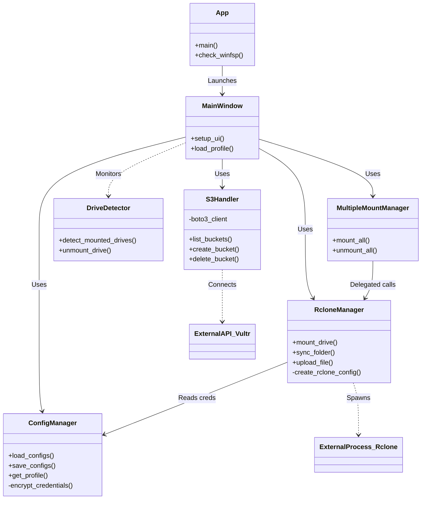

# Arquitectura del Sistema VultrDriveDesktop

Este documento proporciona una visión detallada de la estructura y funcionamiento del sistema **VultrDriveDesktop**.

## 1. Visión General
**VultrDriveDesktop** es una aplicación de escritorio desarrollada en **Python** y **PyQt6** que actúa como un cliente GUI avanzado para Vultr Object Storage. Su función principal es permitir al usuario montar buckets de almacenamiento como unidades locales de Windows, sincronizar carpetas y gestionar archivos, abstrayendo la complejidad de las herramientas subyacentes.

### Tecnologías Clave
- **Frontend**: PyQt6 (Interfaz de usuario).
- **Backend Lógico**: Python 3.11+.
- **Motor de Almacenamiento**:
    - **Rclone**: Usado para montaje (mounting), sincronización de alto rendimiento y transferencia de archivos.
    - **Boto3**: Usado para operaciones de plano de control (crear/borrar buckets) y subidas simples.
- **Sistema de Archivos**: WinFsp (Permite crear unidades virtuales en Windows).

## 2. Diagrama de Estructura
El siguiente diagrama ilustra las relaciones entre los componentes principales del sistema.

## 3. Análisis de Componentes

### Capa de Núcleo (Core)

#### `app.py` (Punto de Entrada)
Es el orquestador inicial. Sus responsabilidades son:
1.  **Verificación de Entorno**: Comprueba si **WinFsp** está instalado. Si no, intenta instalarlo silenciosamente.
2.  **Inicialización**: Carga preferencias de usuario (idioma, tema) y el sistema de logging.
3.  **Lanzamiento GUI**: Inicia `MainWindow`.

#### `config_manager.py` (Gestión de Estado)
Encargado de la persistencia de datos. Gestiona el archivo `config.json` que almacena:
-   Perfiles de conexión (Access/Secret Keys).
-   Planes de rendimiento de Rclone (Ultra, Balanced, Stability).
-   Estado de la aplicación.
Soporta cifrado de credenciales para mayor seguridad.

#### `rclone_manager.py` (Motor de Operaciones)
Es el componente más crítico para el rendimiento. Envuelve el ejecutable `rclone.exe`.
-   **Montaje**: Ejecuta `rclone mount` como un subproceso en segundo plano, integrándose con WinFsp para crear la unidad (ej: `V:`).
-   **Gestión de Procesos**: Mantiene referencias a los procesos de montaje para poder terminarlos limpiamente.
-   **Configuración Dinámica**: Genera archivos `rclone.conf` temporales basados en los perfiles de `ConfigManager`.

#### `s3_handler.py` (Operaciones API)
Utiliza la librería `boto3` para interactuar directamente con la API S3 de Vultr. Se usa para operaciones rápidas que no requieren montar una unidad:
-   Listar buckets disponibles para los desplegables.
-   Crear y eliminar buckets.
-   Subidas de archivos individuales pequeños.

#### `drive_detector.py` (Monitor)
Un servicio de monitoreo que escanea el sistema en busca de unidades activas.
-   Detecta unidades montadas (letras V-Z).
-   Asocia letras de unidad con PIDs de procesos `rclone`.
-   Permite desmontar unidades "huérfanas" o gestionadas externamente.

### Capa de Interfaz (UI)

La interfaz es modular, dividida en pestañas (`ui/`):
-   **Main Tab**: Selección de perfil y bucket, gestión rápida.
-   **Mount Tab**: Configuración avanzada de montaje (elección de letra, modo de caché).
-   **Sync Tab**: Herramientas para sincronización bidireccional o espejo de carpetas locales.
-   **Monitoring Tab**: Visualización de logs en tiempo real y estado del sistema.

## 4. Flujos de Trabajo Principales

### Flujo de Montaje de Unidad
1.  El usuario selecciona un perfil (ej: "Vultr New Jersey") y un bucket.
2.  `MainWindow` solicita a `RcloneManager` montar en una letra (ej: `Z:`).
3.  `RcloneManager` genera una configuración temporal.
4.  Se lanza el proceso `rclone mount` con flags optimizados (vfs-cache-mode, buffer-size).
5.  `DriveDetector` confirma que la unidad `Z:` ha aparecido en el sistema.

### Flujo de Restauración (Git)
El sistema incluye integración con Git para control de versiones del propio código fuente de la aplicación, permitiendo actualizaciones y control de cambios directamente desde el entorno de desarrollo.

## 5. Estado Actual
El sistema es funcional y estable.
-   **Python**: Instalado y configurado.
-   **Dependencias**: Todas instaladas (`PyQt6`, `boto3`).
-   **Git**: Restaurado y vinculado al repositorio remoto.
-   **Configuración**: Perfiles de Vultr cargados correctamente.
